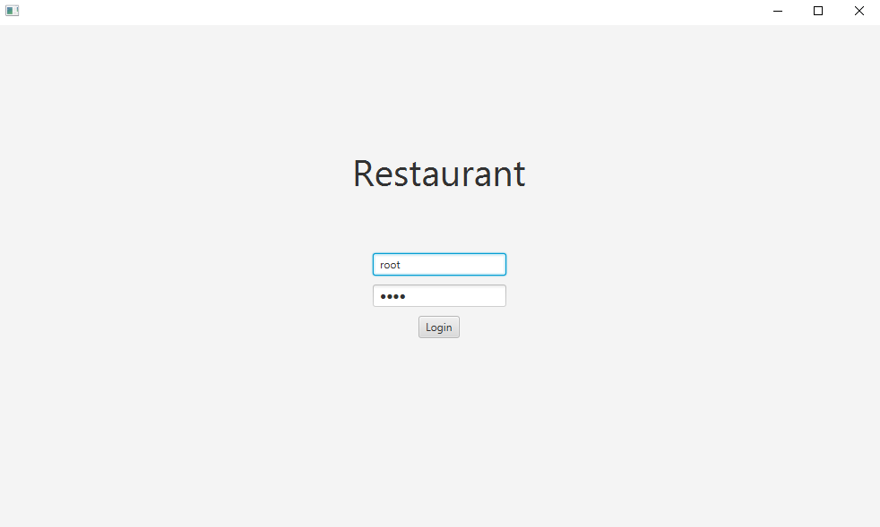
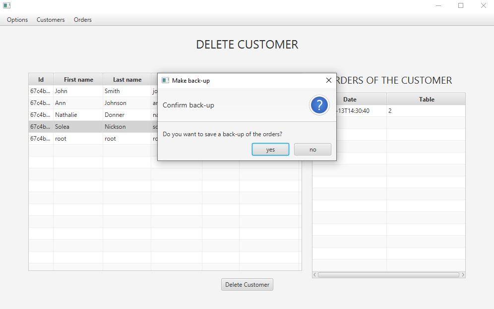
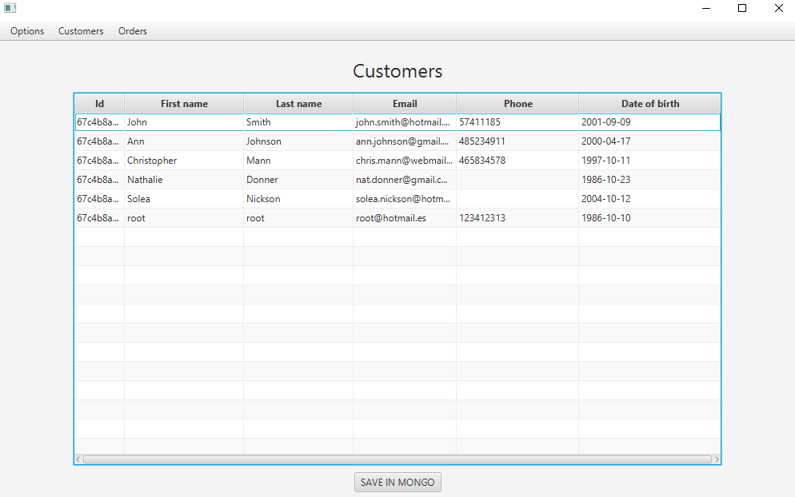
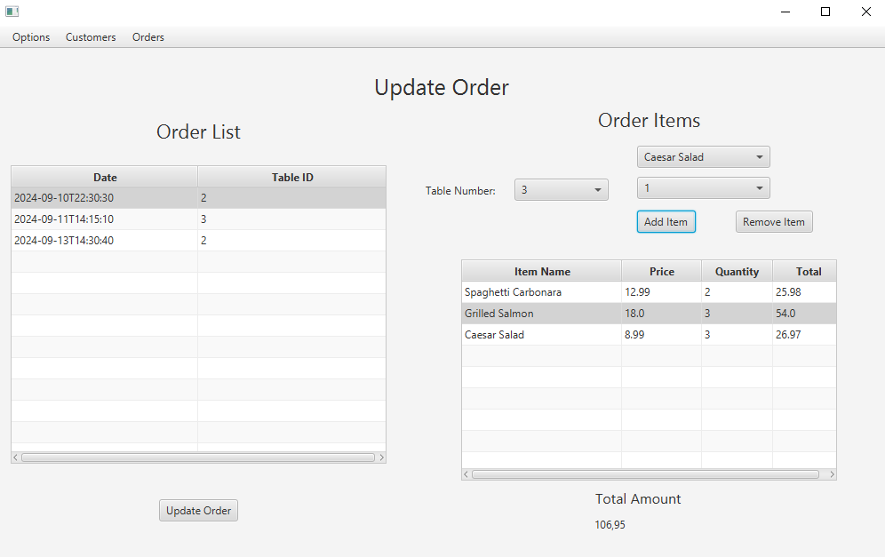

# **App_Restaurante**  

App_Restaurante es una aplicación de escritorio desarrollada en **Java** y **JavaFX** que simula el funcionamiento de un restaurante. Cuenta con dos secciones principales: **Clientes** y **Órdenes**.
Además hay otro ejecutbale en el que se hay varios ejemplos de consultas de MongoDB llamadas Aggregations
## **¿En qué consiste?**  

### **Sección Clientes:**  
- El administrador podrá **ver, añadir, editar y eliminar clientes**.  
- Si un cliente tiene órdenes registradas y se intenta eliminar, se solicitará una **copia de seguridad en formato XML**.  
- Solo el **administrador** tendrá acceso a esta sección.  

### **Sección Órdenes:**  
- El administrador podrá **ver, editar y eliminar en todas las órdenes**.  
- Los clientes podrán **añadir y ver sus propias órdenes**.  

## **Características principales**  
- **Aplicación de escritorio**: completamente ejecutable.  
- **Diseño sencillo y visual**: uso de **tablas y combobox** para gestionar los datos de forma intuitiva.  
- **Control de errores**: validaciones integradas para evitar errores de entrada del usuario.  

## **Tecnologías aplicadas**  
- **JavaFX**: Framework de Java para interfaces gráficas en XML.  
- **Java**: Lenguaje de programación principal.  
- **Modelo en capas**: Organización estructurada en **common, dao, model, services y ui**.

## **Arquitectura del Sistema**  
- **Cliente (Aplicación de escritorio)**: Interfaz desarrollada en **JavaFX**.  
- **Backend**: Recogida de datos mediante **TXT, XML, JDBC y Spring**.  
- **Base de Datos**: Sistema relacional basado en **SQL** y también soporte para **MongoDB**.  
- **Infraestructura con Docker**: Despliegue sencillo mediante contenedores.  

## **Fotos de demostración**
Estas capturas representarían las funciones más destacables de la aplicación

Inicio de sesión
  

Confirmación para hacer respaldo de datos al eliminar un comensal
  

Muestreo de comensales y con exportación a la base de datos en Mongo
  

Interfaz de comanda
  
